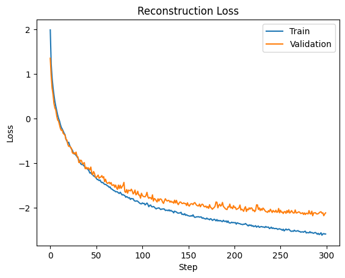
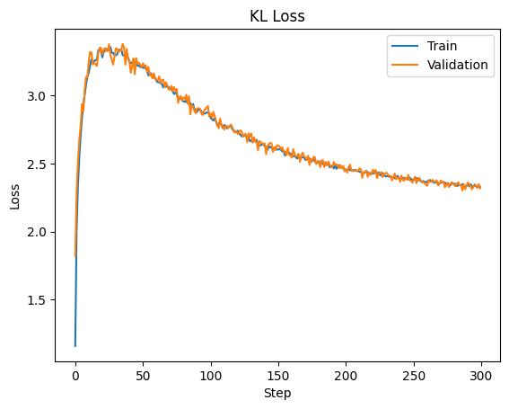
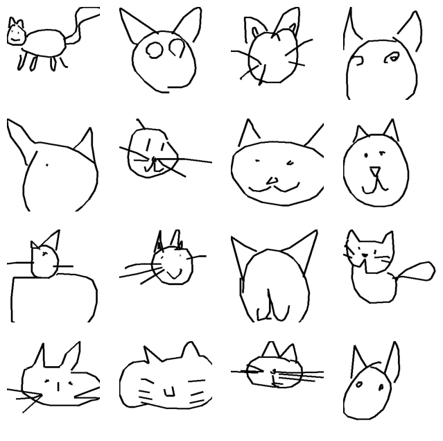
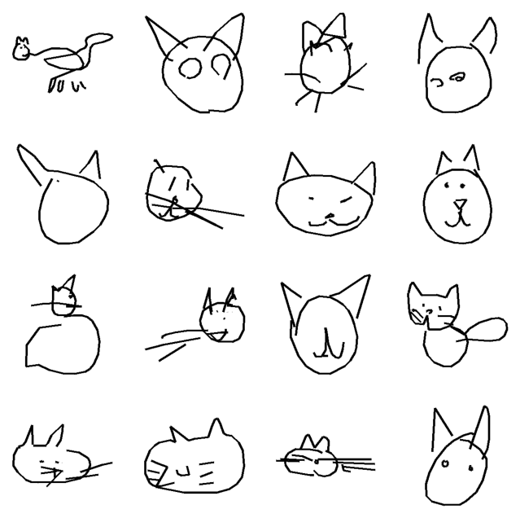
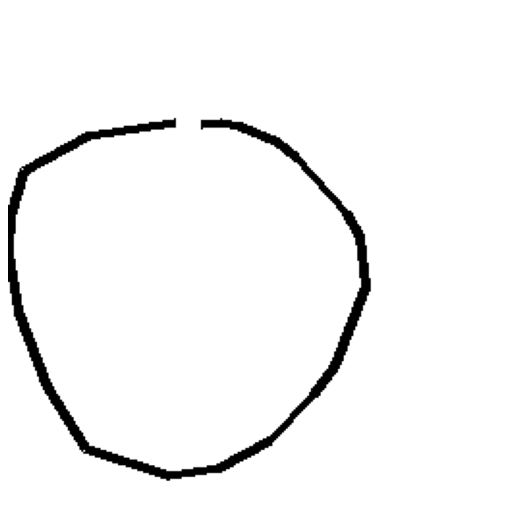
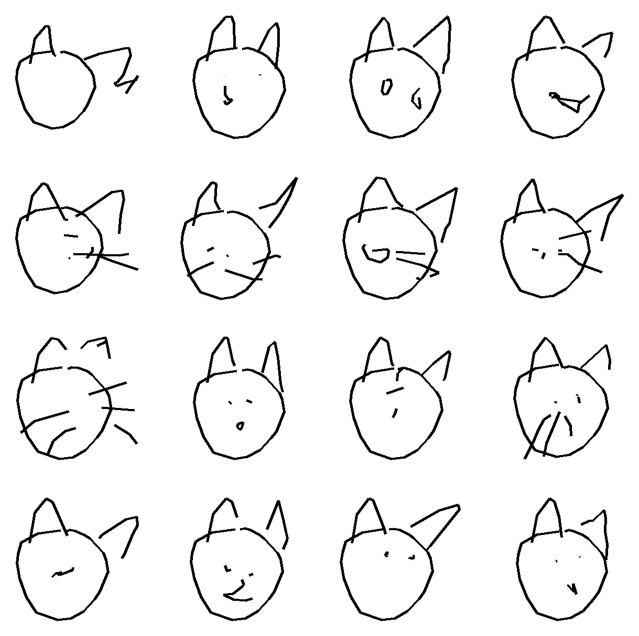
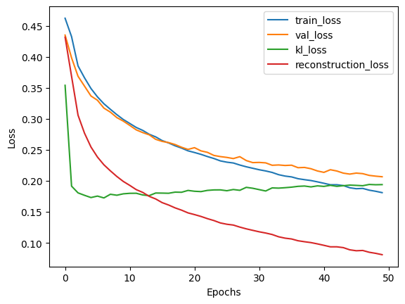
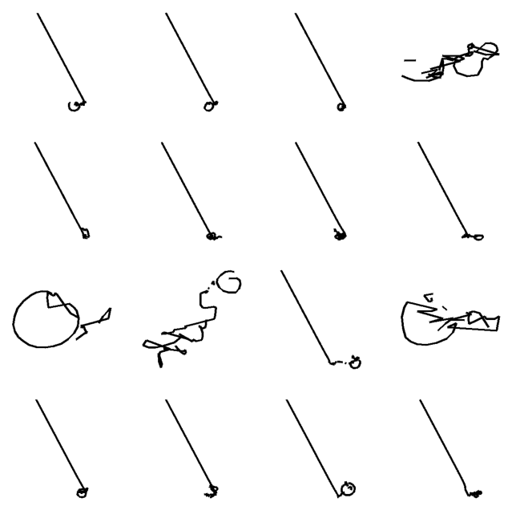

# Summary
This is a pytorch implementation of SketchRNN, a variational autoencoder based architecture used for modeling sequential stroke based drawing. The goal is to predict the next storke using the previous stroke conditioned on the encoder latent output. This experiment was trained on one class from google quickdraw dataset and achieve good output for both sketch reconstruction and generation. 
# Table of Contents
- [Repo Content](#repo-content)
- [Key Features](#key-features)
- [Result](#result)
- [Lesson Learnt and Troubleshooting](#lesson-learnt-and-troubleshooting)
- [Limitation](#limitation)
# Repo Content
- SketchRNN.py: the main model class with train step and inference function
- encoder.py: the encoder module of the model
- decoder.py: the decoder module of the model
- customlstm.py: an implementation of lstm with recurrent dropout
- Sketchrnn.ipynb: a notebook used to train the model

# Features

## Architecture
## Architecture

- **Model overview**
  - Based on a Variational Autoencoder (VAE) with an encoder–decoder structure  
  - Encoder: bidirectional RNN  
  - Decoder: autoregressive unidirectional RNN trained with teacher forcing  

- **Latent representation**
  - Encoder outputs a latent vector representing the overall structure of the input sketch  

- **Decoder output**
  - Outputs parameters of a multivariate GMM  
  - GMM models pen movement $(dx, dy)$  
  - Sampling from GMM produces stroke offsets  
  - Also outputs one-hot pen states (pen up, pen down, end of drawing)  

- **Training strategy**
  - Randomly truncated sketches are used as input to the encoder  
  - Encoder produces latent vector $z$  
  - Latent vector $z$ conditions every timestep of the decoder  
  - Decoder is trained using teacher forcing  

- **Reconstruction vs generation**
  - Reconstruction: use mean of GMM for $(dx, dy)$  
  - Generation: use stochastic sampling from GMM to generate new strokes  

## loss functions
There are two type of loss functions being used to train the model:
- **Reconstruction loss**
  - Pen state: modeled as a one-hot vector → optimized using cross-entropy loss  
  - Pen movement $(dx, dy)$: modeled with a multivariate GMM → optimized via negative log-likelihood  
  - Measures how closely the generated sketch matches the training data  

- **KL divergence loss**
  - Applied only to the encoder  
  - Measures deviation of latent distribution from $\mathcal{N}(0, I)$  
  - Small deviation → weak encoding; large deviation → risk of memorization  
  - Training behavior: increases early, peaks, then gradually decreases as decoder relies more on teacher forcing  
$$
D_{KL}\big(q(z|x)\,\|\,\mathcal{N}(0, I)\big) = -\frac{1}{2} \sum \left(1 + \log \sigma^2 - \mu^2 - \sigma^2 \right)
$$

## KL annealing
In order to ensure the model doesn't cheat by collapsing the latent space the following equation is used to decrease the reward for collapsing the latent during early epoch.

$\eta_{\text{step}} = 1 - (1 - \eta_{\min}){R^{\text{step}}}$

$Loss_{\text{train}} = L_F + w_{KL}\,\eta_{\text{step}} \max(L_{KL}, L_{\min})$

This weight graually get bigger as training progress allowing the model to optimize the KL to ensure the encoder doesn't just memorize the input sketch.

## Encoder reparamerization trick
This is a technique used in a VAE. The encoder output the mean and variance for the latent space, however in order to ensure stochastic sampling we need to introduce randomness into this latent space but doing so would make training unstable. The trick is to separate the deterministic part of training from the stochastic part. By raparameterize the mean and variance with sample from a standard normal as below we ensure that training remain deterministic while stochatic sampling from the posterior is still possible.  

# Result
## Dataset 
The cat dataset on google quickdraw was used to train the model with approximately ~120,000 samples. The quickdraw format was converted to sketchrnn format, and the pen movement (dx and dy) was normalized by their joint standard deviation. Any sketch that are too long or too short are drop by considering them as outlier using IQR percentile. 

## train and validation loss
The model was trained on 8:2 train/validation split for 300 epoch. The Reconstruction Loss and KL loss can be seen below. 
<table>
<tr>
<td align="center">
 
Reconstruction Loss
</td>
<td align="center">
 
KL Loss
</td>
</tr>
</table>

## Reconstruction and Generation
<table>
<tr>
<td align="center">
 
Ground Truth for Reconstruction
</td>
<td align="center">
 
Model reconstructed output
</td>
</tr>
</table>

<table>
<tr>
<td align="center">
 
Input Sketch
</td>
<td align="center">
 
Different sample generation conditioned on the input sketch
</td>
</tr>
</table>

# Lesson Learnt and Troubleshooting
## Posterior Collapse
During training, the decoder used both the latent space provided by the encoder and the previous stroke provided by teacher forcing. However, this introduce a fundamental failure mode into the design since the decoder can cheat by collapsing the latent space to zero thereby minimizing the loss in earlier epoch. This can be diagnosed by the KL loss flooring at early epoch and the generated drawing are all the same regardless of the input to the encoder. The decoder essentially ignore the latent space which contain global structure information and rely solely on teacherforcing to optimized the loss. This can be prevented by KL annealing which decrease the reward for minimizing the KL loss in early epoch. Later on when reconstrcution quality improve, collpasing the latent space become costly since the model already learned to rely on it.

<table>
<tr>
<td align="center">
 
Loss Collapse
</td>
<td align="center">
 
Reconstruction Collapse
</td>
</tr>
</table>

## Overfitting and Generalization
Larger model tend to overfit on the training, however, smaller model seem to underfit with low quality sketch output. Therefore, a small variance gaussian noise is applied to the teacher forcing input of the decoder during training so that the model can generalized better to the validation set. A small input dropout was also used on the decoder instead of recurrent drop out which slow down training. 
## Task mismatch training between reconstruction and generation 
Initially, the encoder was trained on the entire sketch and the decoder receive teacher forcing input from the entire sketch as well. This allow us to achieve good reconstruction, however generation condition on an incomplete sketch abruptly end after the timestep the decoder was condition on. i.e if n timestep (incomplete sketch) was pass to the encoder, the decoder stop generation after n timestep. In order to resolve this random cutoff of the sketch was used to train the encoder instead while the decoder still receive teacher forcing on the whole sketch. This teach the model that the sketch doesn't end even after the timestep it was conditioned on. 
## Custom LSTM 
During earlier trails of the experiment, a custom lstm cell was also being since it can give full control over the hidden satte thereby allowing us to applied recurrent dropout. The idea is that we corrupt the hidden state of the decoder forcing the model to rely more the latent space, however, this greatly reduce the training speed and therefore keras lstm was used instead. 
